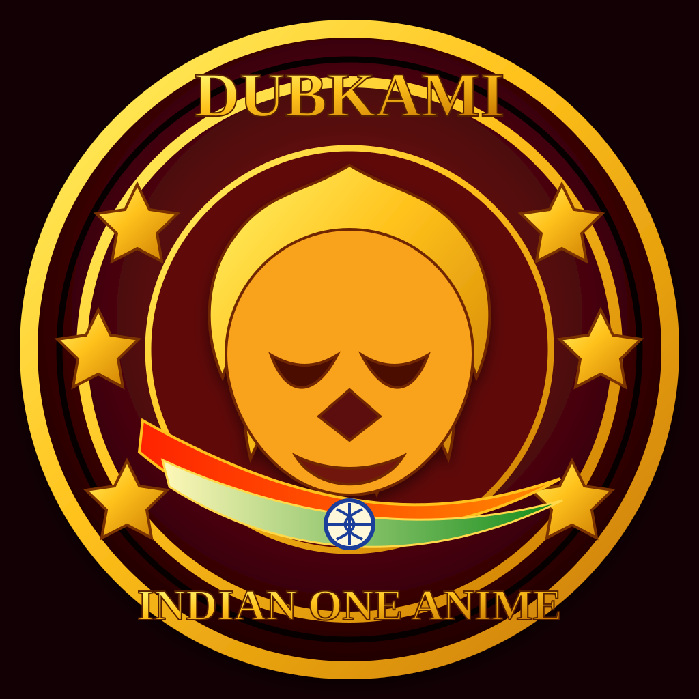

# Indian One Anime — Complete Homepage Copy

## Next Phase Documents

- [Website UI Design System](website-ui-design-system.md)

---

## Brand Icon

Use this lion emblem as the primary visual icon for the Dubkami mobile experience and Indian One Anime brand family.

---

## 1. Hero Section

### **Indian One Anime**

## **One Destination for Anime Fans**

Discover a premium anime viewing experience designed for fans who love great stories, powerful characters, and unforgettable adventures.

**Explore Anime**
**Get Dubkami App**

**Supporting line:**
**Your Anime Universe in One Place.**

---

## 2. Welcome Section

### **Welcome to Indian One Anime**

Indian One Anime is built for anime fans who want a simple, smooth, and engaging way to explore anime content.

Discover your next favorite series, explore different anime genres, and enjoy a modern viewing experience designed with fans in mind.

**Explore the Anime Universe →**

---

## 3. Features Section

### **Everything Anime Fans Need**

#### 🎬 Smooth Viewing Experience

Enjoy a clean and comfortable anime-watching experience across supported devices.

#### ⚡ Fast & Easy Navigation

Find your favorite anime quickly with simple navigation and organized content.

#### 🖥️ High-Quality Playback

Enjoy clear and immersive video playback where supported.

#### 📱 Mobile-Friendly Experience

Explore anime comfortably on smartphones, tablets, and other supported devices.

#### 🎭 Discover New Anime

Explore different genres, characters, stories, and worlds.

#### 🔄 Flexible Playback

Enjoy supported playback options designed to make viewing more convenient.

---

## 4. Anime Categories

### **Explore Your Favorite Anime Worlds**

**Action**
Powerful battles, unforgettable heroes, and intense adventures.

**Adventure**
Explore new worlds, legendary journeys, and epic discoveries.

**Fantasy**
Enter magical worlds filled with mystery, imagination, and wonder.

**Romance**
Experience emotional stories, relationships, and unforgettable moments.

**Comedy**
Enjoy fun characters, hilarious situations, and lighthearted entertainment.

**Isekai**
Discover new worlds, extraordinary powers, and incredible adventures.

**Browse All Categories →**

---

## 5. Featured Anime Section

### **Trending in the Anime Universe**

Discover popular and featured anime content selected for fans looking for their next great watch.

**Explore Featured Anime →**

> इस section में आप बाद में anime posters, rating, genre, language और episode information जोड़ सकते हैं।

---

## 6. Dubkami App Promotion

### **Meet Dubkami**

### **Dubbed Anime, Simplified.**

Take your anime experience with you.

Dubkami is designed for anime fans who want a simple, smooth, and mobile-friendly way to explore available anime content.

**Download Dubkami**
**Learn More**

**App Highlights:**

- Easy anime browsing
- Smooth mobile experience
- Clean and simple interface
- Fast access to available content
- Designed for anime fans

---

## 7. Indian Audience Branding Section

### **Made for Anime Fans in India**

From legendary adventures to exciting new worlds, Indian One Anime brings anime closer to the fans who love it.

**Anime. Stories. Adventure. One Universe.**

---

## 8. About Us

### **About Indian One Anime**

Indian One Anime is a platform created for anime fans who want a better way to discover and enjoy anime content.

Our goal is to create a modern, accessible, and engaging anime experience with simple navigation, quality-focused playback, and a strong community-focused identity.

With **Indian One Anime** as the platform and **Dubkami** as the mobile experience, we are building a brand designed for the next generation of anime fans.

---

## 9. Call-to-Action Section

### **Your Next Anime Adventure Starts Here**

Explore new stories. Discover new characters. Enter new worlds.

## **Start Exploring Today**

**Explore Anime**
**Get Dubkami**

---

## 10. Footer Copy

**Indian One Anime**
**One Destination for Anime Fans.**

Explore anime. Discover stories. Find your next favorite.

**Quick Links**

- Home
- Anime
- Categories
- Dubkami
- About Us
- Contact

**Footer tagline:**
**Your Anime Universe in One Place.**

---

# SEO-Friendly Homepage Content

### SEO Title

**Indian One Anime | Explore Your Anime Universe**

### Meta Description

Explore Indian One Anime, a modern anime platform designed for fans to discover anime content, explore popular genres, and enjoy a smooth viewing experience. Discover Dubkami, your mobile anime experience.

### Suggested Keywords

- Indian anime platform
- anime streaming India
- anime app India
- Dubkami anime app
- anime fans India
- watch anime online
- anime entertainment platform
- dubbed anime app

---

# Best Final Brand Structure

### **INDIAN ONE ANIME**

**One Destination for Anime Fans.**

↓ Powered by / Mobile Experience ↓

### **DUBKAMI**

**Dubbed Anime, Simplified.**

यह structure सबसे साफ और professional लगेगा: **Indian One Anime** आपका main platform/website brand रहेगा और **Dubkami** उसका dedicated app brand।

---

# Final Brand Identity

### 🦁 Indian One Anime

**One Destination for Anime Fans.**

**Role:** Main website / anime platform

### 📱 Dubkami

**Dubbed Anime, Simplified.**

**Role:** Dedicated mobile app experience

### 🌐 Master Brand Line

**Your Anime Universe in One Place.**

## Recommended Website Flow

**Hero** → Indian One Anime
**Discover** → Anime categories and featured content
**Trending** → Dynamic anime section
**Experience** → Platform features
**Mobile** → Dubkami app promotion
**About** → Brand story
**CTA** → Start Exploring Today

यह structure brand को **premium, memorable और scalable** बनाता है। आगे चलकर आप इसी identity के अंदर additional features, community tools, watchlists, notifications और app services भी जोड़ सकते हैं, बिना main brand को बदलने की जरूरत पड़े।

---

## Entertainment Streaming Full Upgrade Scope

To move from a simple promo experience to a complete entertainment streaming brand presence, build the website and app around the same content journey:

### Website Upgrade Priorities

- Landing page with hero banner, featured anime, trending rails, and category discovery
- Dedicated anime detail pages with synopsis, language badges, episode status, and related recommendations
- Search and filter experience for genre, language, and popularity-based browsing
- Mobile-first layouts that keep the Dubkami app CTA visible throughout high-intent sections

### Dubkami App Upgrade Priorities

- Home experience matching the website sections for easy brand continuity
- Featured, trending, and continue-exploring rows with clear poster-first navigation
- Streamlined detail screens with episode access, highlights, and lightweight actions
- Download and onboarding touchpoints focused on fast discovery and smooth entertainment browsing

### Shared Experience Goals

- Keep Indian One Anime as the primary website/platform identity
- Keep Dubkami as the dedicated mobile app experience
- Maintain one tone of voice across both products: premium, exciting, simple, and fan-focused
- Roll out upgrades in phases so the brand can expand without confusing users

**Final positioning:**

> **Indian One Anime** is the platform.
> **Dubkami** is the mobile experience.
> **Anime is the universe.**
